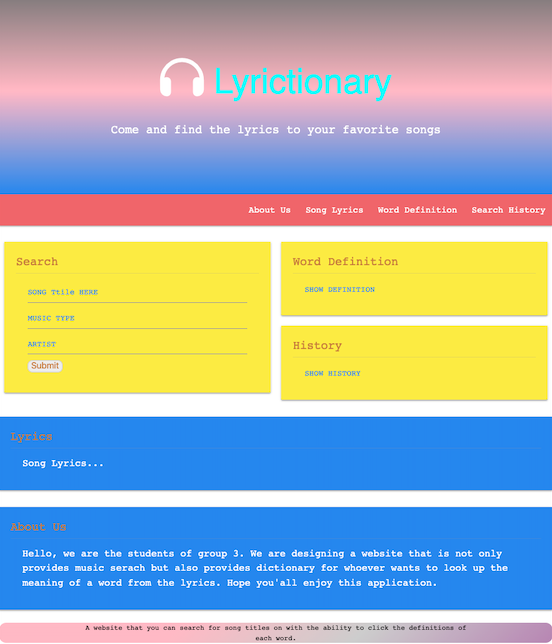

# We are Group 3
### Project Name: lyrictionary
---
### Group Members: 
1. Jason Hardy, 
2. Dan Erekson, 
3. Chen Chao-Ying(Joyce)
4. Ryan Jewell
---
### Project Purpose: This is a website that searches for song lyrics and provides definitions.
---
### Project Description: This isa site or app that you can search for song titles on with the ability to click on words to give the definitions of each word.
---
### User Story:
* AS a listener of music
* THEN I want to be able to look up a song
* THEN I see the lyrics to that song
* WHEN I click on a word in the lyrics
* WHEN I want to see the definition of that word
* SO THAT I can know what that word means if I didn’t understand

---

### Deployed Image: 

---
 
* Github URL: 
https://github.com/derekson333/lyrictionary

* Github Deployed Page: 
https://derekson333.github.io/lyrictionary/

---
<h5>
Group 3 Members: Jason Hardy | 
Dan Erekson | Joyce Chen | Ryan Jewell<h5>

